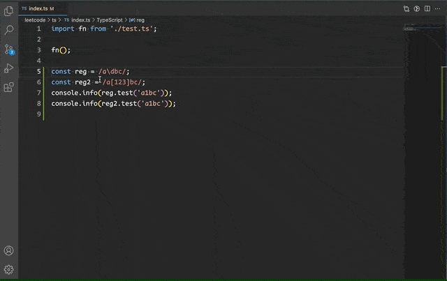
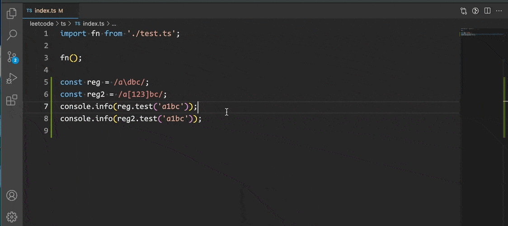
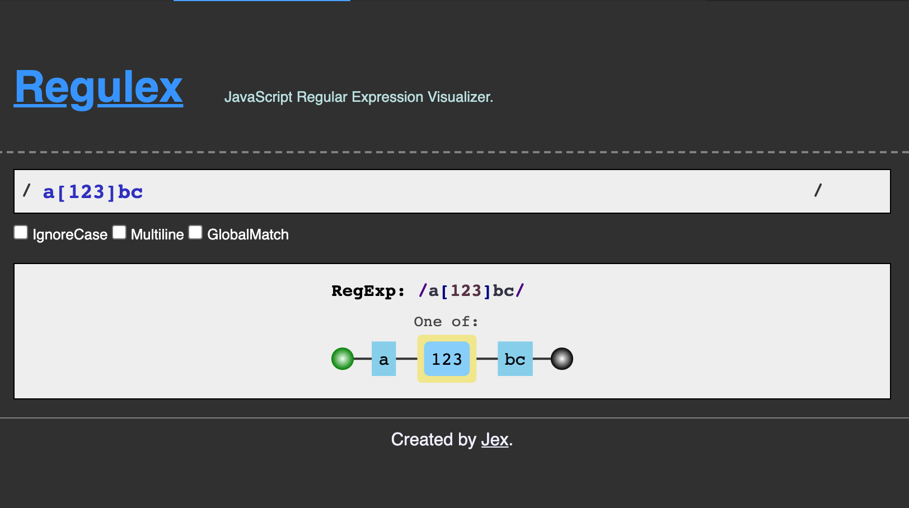
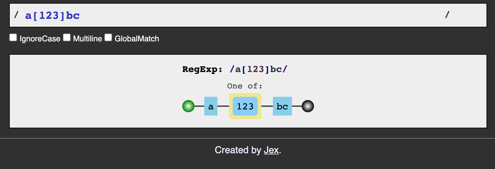
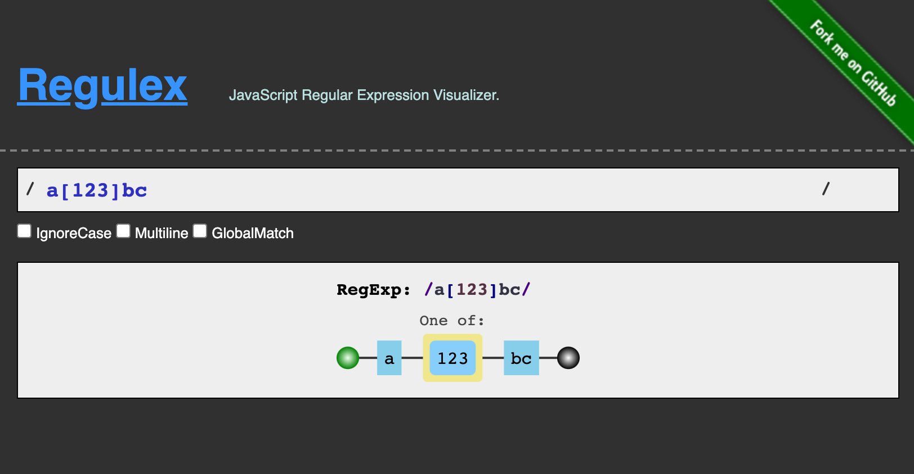
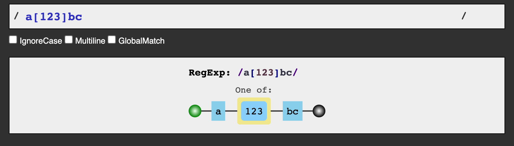

# reg-visualizer README

Visualize selected or user entered regexp. The core feature is from [Regulex](https://jex.im/regulex/#!flags=&re=%5E(a%7Cb)*%3F%24)

The original author of regulex is probably leave the internet. I am grateful for his excellent work.

## Features

1. You can select and right click on a rexexp in editor, select `RegExp Visualize` to visualize it.
2. You can execute `RegExp Visualize` command in command palette and input a regexp to visualize it.
3. You can config to hide some sections including header, fork icon and footer.

### select regexp

### enter regexp

### hide fork icon

### hide header

### hide footer

### hide all

## Extension Settings

This extension contributes the following settings:

* `reg-visualizer.webview-mode`: Whether add a new webview on each visualization.
* `reg-visualizer.hide-header`: Hide the header section of webview, including title and github fork icon..
* `reg-visualizer.hide-footer`: Hide the footer section of webview.
* `reg-visualizer.hide-fork`: Hide the github fork icon.

## Known Issues

NAN

## Release Notes

### 0.0.1

Initial release
